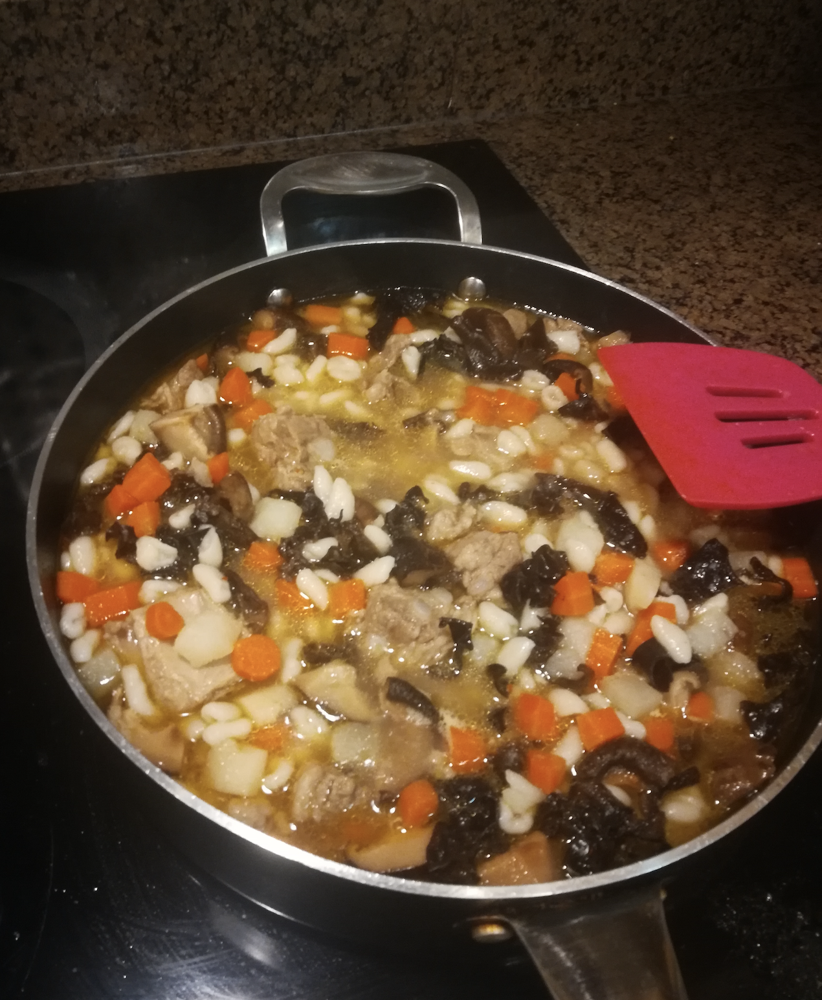

Not a dish from my culture but my friend's mom from Northern China used to cook
this for us when she was staying in Vancouver for a while.

My friend and I love this dish so much but making the noodles is such a tedious
work so we couldn't have it very often. A couple of years ago we got the recipe
from her mom and since then we cook this soup every winter (and in other seasons
when we are craving).

  

[**Recipe for the Noodles**](https://keitopotato.wordpress.com/2018/01/01/mashi-chinese-rolled-shell-pasta/)

#### Preparation:

1.  Boil chopped pork rib with green onion and ginger at mid heat until the meat
    is tender (2 hrs)
2.  Soak dried shiitake mushrooms and wood ear mushrooms in warm water until
    they are soft

#### Directions for the Soup:

1.  Dice carrots and potatoes and lightly stir fry them.
2.  Chop the mushrooms and add them to the pot.
3.  Add water, pork broth and mushroom broth from the prep steps and cook at mid
    heat until veggies are soft. I also add finely chopped hot chilli peppers to
    make the soup super hot.
4.  Season the soup with salt, soy sauce, Chinese cooking wine and chicken soup
    stock powder.
5.  Serve it in a bowl and add a bunch of homemade chilli pepper sauce.
